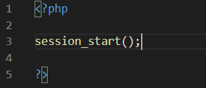
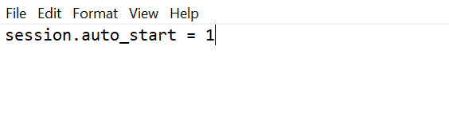
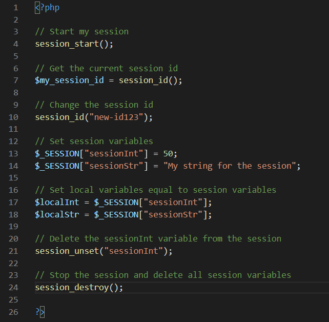

# Introduction

## PHP

PHP (PHP: Hypertext Preprocessor) is a programming language frequently used in web development. Unlike front-end development using languages such as JavaScript, PHP code is run on the server end of things. This provides a serious advantage to developers who want to run code in the background, especially if the developers don't want users to see the website code or if developers want to make a lot of queries to databases and storage found on the server (this is possible in JavaScript, but it can be a lot harder!). Working on the server side, however, means that PHP needs a way to store data in between users closing and opening browser tabs. Sometimes a user wants to navigate to different parts of the website and then come back and still be logged in. Or maybe a user decides to close down their web browser and see all the data the way it was left when that user opens the website again. PHP needs a way to handle this, and it does so using sessions.

## What is a PHP Session?

If you go to the [php.net](https://www.php.net/manual/en/intro.session.php) session page, the website describes a session as "a way to preserve certain data across subsequent access." What this means, simply, is that a PHP session allows a website to store data on one webpage and retrieve it from another. A common use of this is to get sign-in info from a login page and then use sessions to "remember" which user is signed in as they access different parts of a website. This isn't the only way to use sessions though, and there are plenty of reasons that a web developer might want to learn how to use sessions in PHP.

For the purpose of this tutorial, I will assume that you are following along and typing the code out as well. Feel free to just read along without coding yourself if you want, but from here on out I will be speaking as if you have your favorite text editor in front of you. When I say to include code somewhere, unless I explicitly state otherwise I will assume you have some sort of php file, a simple index.php works fine. In order to actually run the code you will need to either have a webserver set up to test it on, use a program like Docker, or take advantage of PHP's built-in web server (the PHP built-in webserver won't work for PHP older than 5.4, but unless you are deliberately using older versions of PHP you shouldn't run into any problems). Setting up webservers or using Docker is outside of the scope of this tutorial, but if you choose to use PHP's built-in webserver you can find information on it [here](https://www.php.net/manual/en/features.commandline.webserver.php). For the quick-and-dirty run down of what the documentation says:
1. Install PHP on your machine
2. Open terminal or Powershell (depending on what operating system you are running)
3. Change directory (`cd`) into the folder you want to test PHP in
4. Run `php -S localhost:8000`
5. Now if you have an index.php file in that folder, you can test it by typing "http://localhost:8000" into your web browser.

For any further questions on using the built-in web server, refer back to the documentation.

# How to Start With PHP Sessions

## Initializing a Session

The very first step to getting a PHP session up and running is telling PHP that you want to start that session. There are two ways to do this - either manually or automatically. The manual way might be a little more cumbersome if you are trying to code lots and lots of webpages in PHP and don't want to keep typing the same line over and over again, but the automatic way deals with configuration files and can be a little trickier to setup and manage. So use manual if you just have a few pages or don't want to mess with any config files, and use automatic if you would rather avoid typing extra code.

### Manual method

To start a session manually, go to your php file. In between `<?php` and `?>` tags (if you don't have these lines yet, make sure to add them), type `session_start();` Just like that, your webpage has started using a session! This is what my code looks like at this point:\
Figure 1: Manual Session Start\
.  

### Automatic method
The automatic method of starting a session is slightly more complicated. In the same folder as your index.php file, look for a php.ini file. If one doesn't yet exist, create a new text file called "php.ini". Inside your file, add the line "session.auto_start = 1" and then save your changes. PHP will now start sessions automatically. This is what a newly created php.ini file looks like for me:\
Figure 2: Session Auto Start\

## Session IDs

At this point you may be wondering: if I choose to use `session_start()` several times in different webpages, how does my website know how to associate that new session with me? Sessions are stored on the server, after all, so how does it know which user is starting a session? This is where a session id comes in handy. When a new session is created, the server automatically creates a unique id that it associates with that user. It then passes the id number to the client with all of the other requested data. Now, every time that the client uses a webpage that tries to start a session, the client computer will send that id to the server along with the request. This way, you don't need to worry about the server forgetting who you are!

For a variety of reasons, you may wish to either retrieve the session id or set it yourself. For this, you can use the command `session_id();`. To retrieve the current session id, calling the command without any parameters returns the current id. So if I wanted to retrieve the current id and store it in a variable, I would do something like `$my_session_id = session_id();`, where `$my_session_id` can be replaced by whatever variable name you choose. On the other hand, if I wanted to set my session id to be something of my choosing (maybe my website is going to use this id later for something else and I need it to be in a specific format), then I would type `session_id("MyID1234")`. Please note, however, that session ids follow a very specific format! If you don't insert a valid id, `session_id()` won't throw any errors and instead you will have a problem the next time PHP tries to start a session. A session id only accepts the following characters (and then, it only accepts between 1 and 128 digits):
* `-`
* `,`
* `a-z`
* `A-Z`
* `0-9`

For more information on `session_id()` see [here](https://www.php.net/manual/en/function.session-id.php).

## Session Variables

Arguably, setting session variables is the most important use of sessions. Session variables are what allow different webpages to communicate using the same information, and these variables make it possible to have consistent experiences across different parts of a website. Once a session is initialized, it is very easy to access session variables! To create a new session variable or change a session variable's value, just call `$_SESSION["variableName"] = variableValue;` Now, you have a new session variable called "variableName" with the value "variableValue". To get that variable back, use `$localVariable = $_SESSION["variableName"];` and you now have the session variable stored as a PHP variable for that webpage.

If you want to remove a session variable, the command `session_unset("variableName");` and your session variable will be deleted.

## Terminating session

Sometimes you will want to stop a session. This is common if you want to log a user out and have their session stop taking space, or if you are just trying to keep session usage to a minimum and no longer need the session. To stop a session, use the command `session_destroy();`. Please be aware that this will delete all the session variables as well, so use this in your code until you don't need sessions anymore!

## Screenshot of All the Included Code   

Here is a screenshot of what my code looks like with all the different parts in one place:\
Figure 3: Code in one place\

# Additional Resources

The following is a list of additional resources to reference:
* [https://code.tutsplus.com/tutorials/how-to-use-sessions-and-session-variables-in-php--cms-31839](https://code.tutsplus.com/tutorials/how-to-use-sessions-and-session-variables-in-php--cms-31839): this website gives a great introduction to sessions. It does a really good job at describing what a session is in more detail. It assumes some knowledge of HTTP and how webservices work.
* [https://www.php.net](https://www.php.net): this has lots of information about PHP, as well as being the official download location for the language. Their documentation section is very detailed, but it assumes a pretty high level of general programming understanding.
* [https://mediatemple.net/community/products/dv/204403894/how-can-i-edit-the-php.ini-file](https://mediatemple.net/community/products/dv/204403894/how-can-i-edit-the-php.ini-file#:~:text=Overview-,The%20php.,file%20timeouts%2C%20and%20resource%20limits.): This website is actually instructions on how to edit the php.ini file for their specific service, but it does a pretty good job explaining what the php.ini file is and how to modify it. Just make sure to ignore anything that references their services if you are looking for general information.
* [https://www.w3schools.com/php/php_sessions.asp](https://www.w3schools.com/php/php_sessions.asp): w3schools does a very good job at teaching the basics of lots of programming languages, and the same is true for PHP. This link leads to an intro on PHP sessions. They do a really good job at providing demos and examples, but be sure to look to other resources once you start having more technical questions.